Here’s the README in markdown format for your project:

# OSX-NetScan Advanced

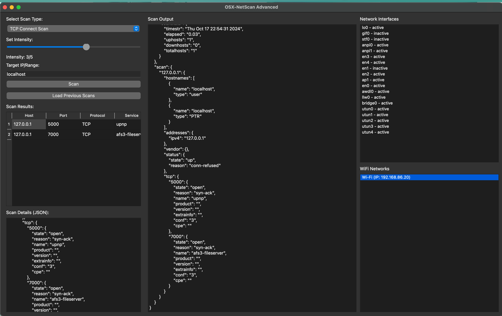

**An advanced network scanning tool tailored for macOS.**

## Features

- **Comprehensive Scanning:** Perform in-depth scans to identify open ports, services, and vulnerabilities across network devices.
- **Real-Time Alerts:** Set custom alert rules for specific hosts and ports.
- **WiFi and Network Interface Monitoring:** Keep track of both WiFi networks and local interfaces with detailed interface highlights based on active connections.
- **Scheduled Scans:** Configure scans to run automatically at specified intervals.
- **GUI Configuration:** Easily manage scan settings and alert rules through a user-friendly interface.
- **Detailed Logs and Reports:** All scan activities are logged and viewable in JSON format for in-depth analysis.

## Configuration Examples

Customize Alerts

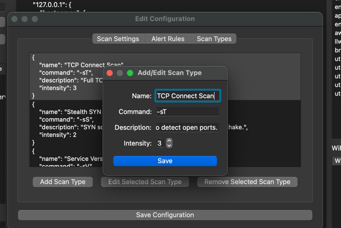

Auto-Background Res-scan (Careful with Agression Level)

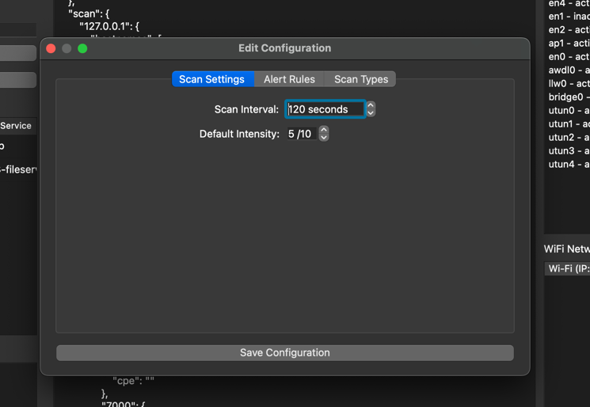

Adding alerts:

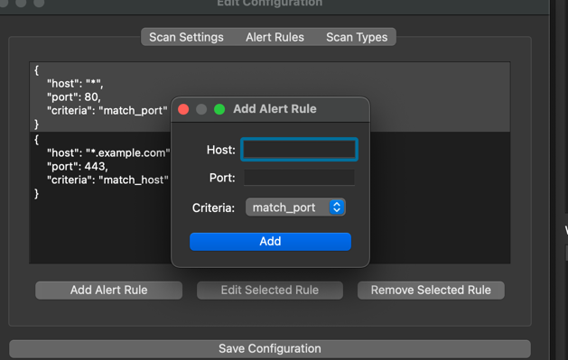
## Prerequisites

- macOS 14 or higher
- Python 3.8 or higher
- Dependencies:
  - PyQt5
  - nmap (network scanning tool)
  - qasync (for asynchronous operations)

### Install the Required Dependencies

```bash
pip install PyQt5 python-nmap qasync
```

#### Running the Application

1.	Clone the repository:

```bash
git clone https://github.com/yourusername/osx-netscan.git
```

2.	Navigate to the project directory:

```bash
cd osx-netscan
```

3. Run the application:

```bash
python src/main.py
```


## Configuration

The application uses two configuration files: config.json for scan settings and alerts.json for alert rules. These can be edited manually or through the GUI.

### config.json Example
```json
{
    "scan_interval": 3600,  // Scan every hour (in seconds)
    "default_intensity": 5,
    "alert_rules": [
        {
            "host": "*",
            "port": 80,
            "criteria": "match_port"
        },
        {
            "host": "*.example.com",
            "port": 443,
            "criteria": "match_host"
        }
    ],
    "scan_types": [
        {
            "name": "TCP Connect Scan",
            "command": "-sT",
            "description": "Full TCP handshake to detect open ports.",
            "intensity": 3
        },
        {
            "name": "Stealth SYN Scan",
            "command": "-sS",
            "description": "SYN scan for open ports without completing the handshake.",
            "intensity": 2
        },
        {
            "name": "Service Version Detection",
            "command": "-sV",
            "description": "Detect service versions on open ports.",
            "intensity": 4
        }
    ]
}
```
### alerts.json Example
```json 
{
    "alerts": [
        {
            "host": "*",
            "port": 80,
            "criteria": "match_port"
        },
        {
            "host": "*.example.com",
            "port": 443,
            "criteria": "match_host"
        }
    ]
}

```

Configuration Options:
```bash
•	scan_interval: Time (in seconds) between scheduled scans.
•	default_intensity: Default intensity for scans, which determines the speed and depth of the scan.
•	alert_rules: Define alert triggers for specific hosts or ports.
•	scan_types: Predefined scan types that can be selected in the GUI.

```
## Usage

### Performing a Scan


	1.	Open the OSX-NetScan Advanced GUI.
	2.	Enter a target IP address or network range (e.g., 192.168.1.0/24) in the target input field.
	3.	Select a scan type from the dropdown menu.
	4.	Adjust the scan intensity using the slider (optional).
	5.	Click the “Scan” button to start scanning.
	6.	View scan results in the table or detailed JSON output.

Custom Alerts

To set up custom alerts, you can edit the alerts.json file or use the GUI to add new rules. Example:

```json
{
    "alerts": [
        {
            "host": "*.example.com",
            "port": 443,
            "criteria": "match_host"
        }
    ]
}
```

Timer-Based Scans

Modify the config.json file’s scan_interval to define how often scans should run. For example, to scan every 30 minutes, set:

```json
{
    "scan_interval": 1800
}
```

## GUI Overview


### Target Input: Specify the IP or network range for scanning.
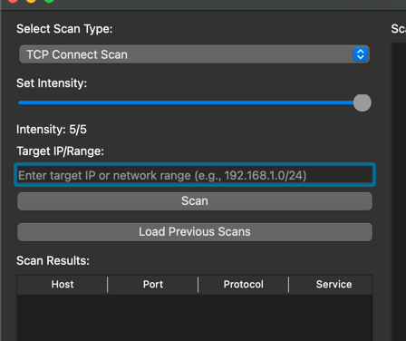

### Scan Type Selector: Choose between multiple scan types (e.g., TCP Connect Scan, SYN Scan).

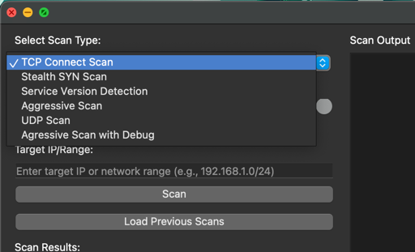

### Scan Intensity Slider: Adjust the scanning intensity from 1 to 5.

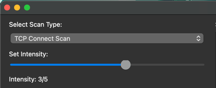

### Results Table: View a summary of scan results, including the host, port, and services found.

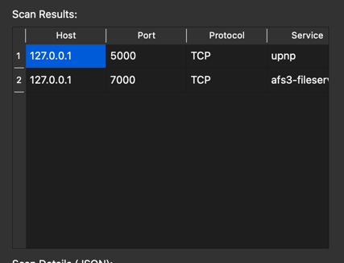

### Detailed JSON View: See the complete scan details in JSON format.

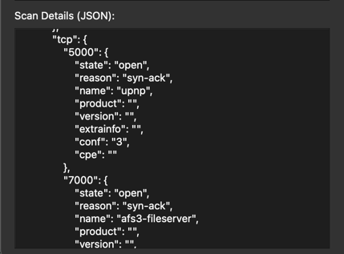

### Network Interface Panel: Monitor local network interfaces and view their details.

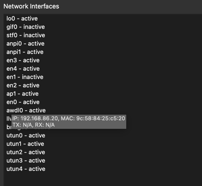

### WiFi Networks Panel: Track nearby WiFi networks and their associated devices.

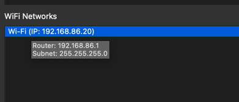

## Example Scan Output:

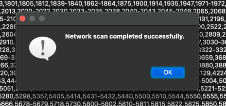
```json
{
    "nmap": {
        "command_line": "nmap -oX - -sT -T5 127.0.0.1",
        "scaninfo": {
            "tcp": {
                "method": "connect",
                "services": "1,3-4,6-7,..."
            }
        },
        "scanstats": {
            "timestr": "Thu Oct 17 15:16:15 2024",
            "elapsed": "6.17",
            "uphosts": "1",
            "totalhosts": "1"
        }
    },
    "scan": {
        "127.0.0.1": {
            "hostnames": [
                {
                    "name": "localhost",
                    "type": "PTR"
                }
            ],
            "addresses": {
                "ipv4": "127.0.0.1"
            },
            "status": {
                "state": "up"
            },
            "tcp": {
                "80": {
                    "state": "open",
                    "name": "http"
                }
            }
        }
    }
}
```

## Contributing

We welcome contributions! Please submit issues or pull requests to help improve this project.

## License

This project is licensed under the MIT License.
